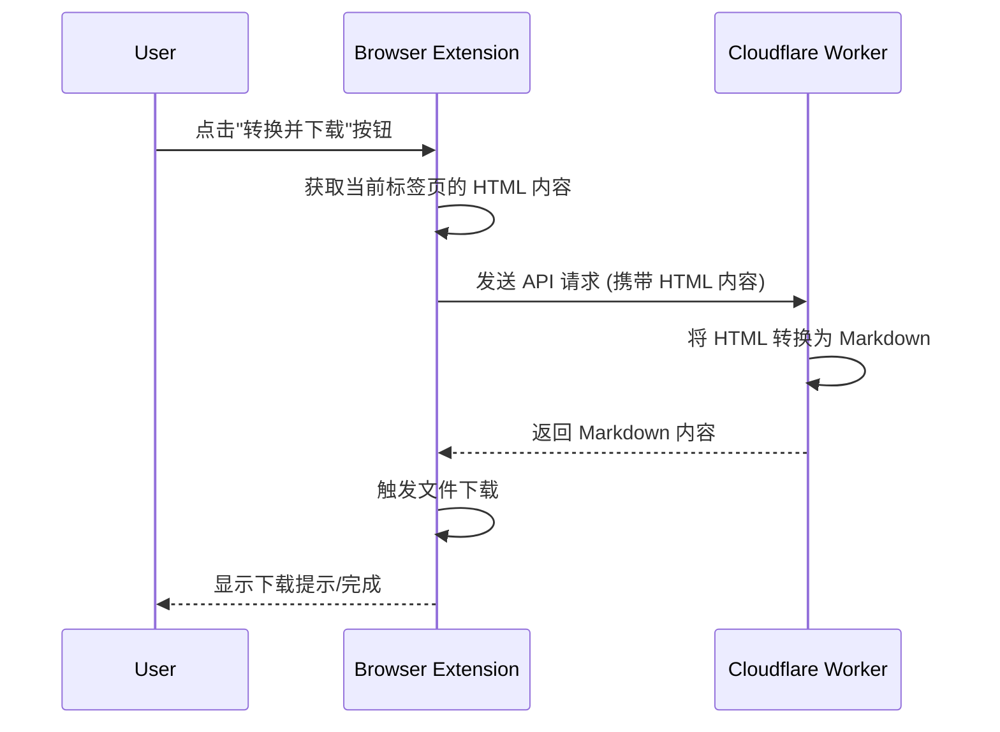

# 架构设计

本文档描述了"网页转 Markdown"项目的系统架构和组件交互。

## 核心组件

1.  **浏览器插件 (Browser Extension)**：用户界面，负责获取当前页面的 HTML 内容，触发转换请求并将结果保存。
2.  **Cloudflare Worker (Server)**：后端服务，负责接收 HTML 内容并将其转换为 Markdown。

## 交互流程

## 组件职责详述

### 1. 浏览器插件

*   **用户界面 (UI)**：提供一个简单的按钮或右键菜单项，让用户可以方便地触发转换操作。
*   **HTML 内容获取**:
    *   使用 `chrome.scripting.executeScript` 在当前激活的标签页上下文中执行脚本，以获取页面的 `document.documentElement.outerHTML` 或特定部分的内容。
*   **权限管理**：
    *   `activeTab`: 允许访问当前激活标签页的信息并执行脚本。
    *   `scripting`: 允许使用 `chrome.scripting` API。
    *   `downloads`: 用于将转换后的 Markdown 文件保存到用户本地。
    *   `storage` (可选): 用于存储用户配置，例如 Worker API 端点等。
*   **API 通信**：
    *   使用 `fetch` API 向 Cloudflare Worker 发送 HTTP 请求。
    *   请求体应包含从页面获取的 HTML 字符串。
    *   处理 API 响应，包括成功返回的 Markdown 内容和可能的错误信息。
*   **内容处理**：
    *   接收 Worker 返回的 Markdown 文本。
    *   构建一个 `Blob` 对象。
    *   使用 `URL.createObjectURL` 和 `chrome.downloads.download` API (或其他浏览器等效 API) 实现文件下载。
    *   文件名可以基于网页标题或用户自定义规则生成。

### 2. Cloudflare Worker

*   **API 端点**：提供一个 HTTP(S) 端点，接收插件的请求。
    *   例如：`POST /api/convert`，请求体中包含 `html` 字段。
*   **HTML 解析与转换**：
    *   接收请求体中的 HTML 字符串。
    *   使用 Markdown 转换库（如 `turndown`）将 HTML 字符串转换为 Markdown 格式。
    *   可以配置转换库的选项，以优化输出的 Markdown 质量。
*   **响应处理**：
    *   将转换后的 Markdown 内容作为 HTTP 响应体返回。
    *   设置合适的 `Content-Type` (如 `text/markdown; charset=utf-8`)。
    *   返回适当的 HTTP 状态码（成功时 200，错误时 4xx/5xx）。
*   **错误处理与日志**：
    *   健壮的错误处理机制，例如无效 JSON、缺少 `html` 字段、转换失败等。
    *   利用 Cloudflare Worker 的日志功能记录关键操作和错误信息，便于调试。

## 数据流

1.  用户在浏览器插件中点击转换按钮。
2.  插件获取当前页面的 HTML 内容。
3.  插件将 HTML 内容发送给 Cloudflare Worker 的 API 端点。
4.  Worker 接收 HTML，使用 Markdown 转换库将其转换为 Markdown。
5.  Worker 将 Markdown 文本返回给插件。
6.  插件接收 Markdown 文本，并触发浏览器下载功能，将文本保存为 `.md` 文件。

## 安全考量

*   **Worker 端**：
    *   对接收的 HTML 内容大小进行限制，防止超大请求耗尽资源。
    *   如果 HTML 内容中包含 `<script>` 标签或潜在的恶意内容，`turndown` 库通常会将其转换为文本或忽略，但仍需注意转换库的安全性。
    *   考虑对请求进行速率限制。
*   **插件端**：
    *   确保只与预期的 Worker 端点通信。
    *   通过 `chrome.scripting.executeScript` 获取 HTML 时，注意脚本注入的安全性（虽然这里是获取内容，不是修改）。

## 扩展性

*   **自定义转换规则**：未来可以允许用户在插件端配置 Markdown 转换规则，并将这些规则传递给 Worker。
*   **多种输出格式**：Worker 可以扩展支持除 Markdown 外的其他格式。 